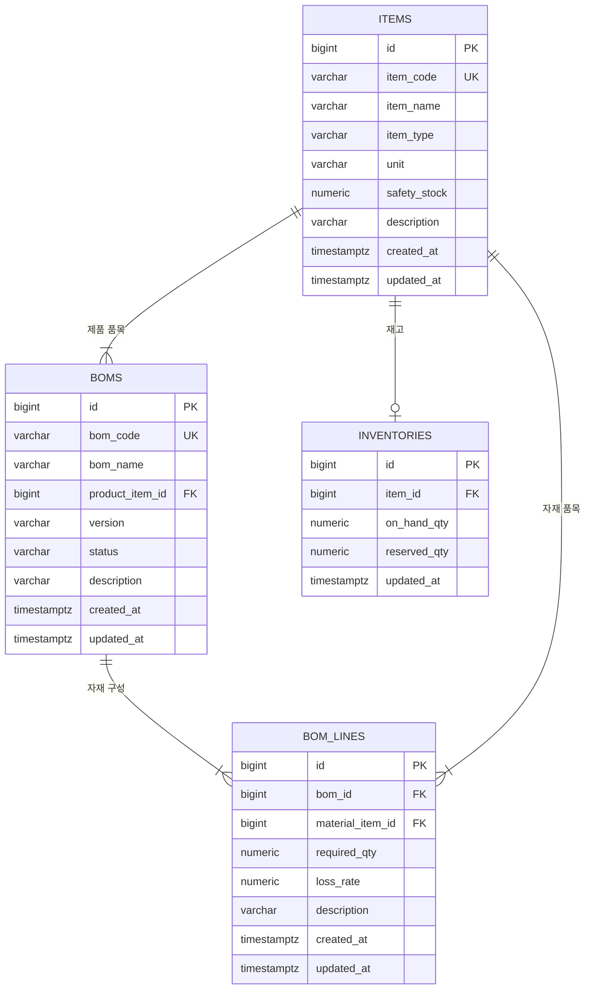

# BOM/MRP ERD 초안

## 목적

BOM 등록과 MRP 계산에 필요한 최소 테이블 관계를 먼저 고정한다. 실무형 확장보다 연습 구현 가능한 범위를 우선한다.

## Mermaid ERD

원본 다이어그램 파일:

```text
docs-for-mes 기본 기능 구현 해보기 계획/01-bom-mrp/bom-mrp-erd.mmd
```



## 테이블 역할

| 테이블 | 역할 |
| --- | --- |
| `items` | 생산품과 자재를 같은 기준정보로 관리 |
| `boms` | 특정 생산품의 BOM 설계서 헤더 |
| `bom_lines` | BOM 설계서에 포함되는 자재와 제품 1개당 소요량 |
| `inventories` | 품목별 현재고와 예약 수량 |

## 핵심 관계

- `boms.product_item_id`는 생산 대상 품목을 가리킨다. 예: 의자
- `bom_lines.bom_id`는 BOM 헤더를 가리킨다.
- `bom_lines.material_item_id`는 필요한 자재 품목을 가리킨다. 예: 나무, 나사
- `inventories.item_id`는 품목별 재고를 가리킨다.

## 읽는 순서

1. `items`에 의자, 나무, 나사 같은 품목을 먼저 등록한다.
2. `boms`에 "의자 표준 BOM" 같은 설계서 헤더를 등록한다.
3. `bom_lines`에 의자 1개를 만들 때 필요한 나무/나사 수량을 등록한다.
4. `inventories`에 나무/나사 현재고와 예약 수량을 등록한다.
5. MRP 계산은 생산 수량과 BOM 라인을 곱해서 필요 수량을 구하고, 재고를 빼서 부족 수량을 계산한다.

## 구현 메모

- 처음에는 단일 창고 재고만 다룬다.
- 다단계 BOM 전개는 제외한다.
- `item_type`은 우선 `PRODUCT`, `MATERIAL`로 시작한다.
- MRP 계산은 `required = 생산수량 * required_qty * (1 + loss_rate)` 기준으로 시작한다.
