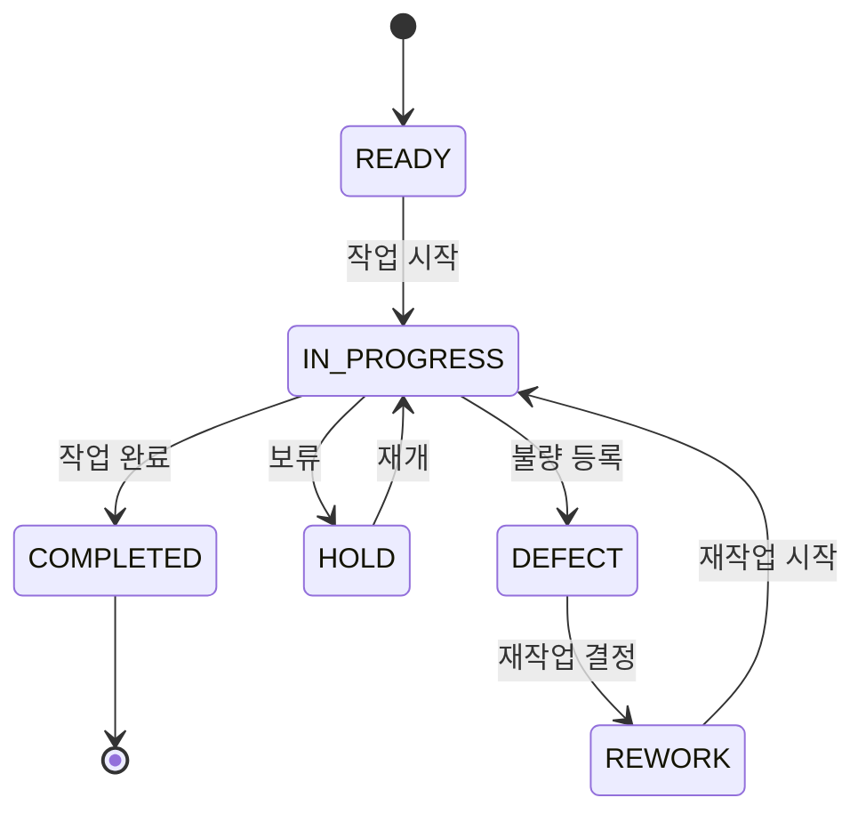

# 레시피 데이터로 저장하는 규격 및 형식

## 목적

이 문서는 노트앱의 `Component Recipes`에 컴퍼넌트 레시피를 저장할 때 지켜야 하는 데이터 구조와 본문 형식을 정의한다. 화면에서 보이는 문서 트리와 서버의 `playbook_*` 테이블 구조를 기준으로 한다.

앞으로 레시피를 추가하거나 수정할 때는 이 문서를 먼저 참고한다. 로컬 Markdown 파일은 검토·백업용이며, 노트앱에 저장할 때는 반드시 Lexical 직렬화 JSON으로 변환한다.

## 1. 문서 계층

노트앱은 다음 3단계 계층으로 레시피를 관리한다.

```text
Space
└── Category
    └── Topic
        └── Document
```

Button 레시피의 실제 위치:

```text
Component Recipes
└── 기본 컴포넌트
    └── Button
        ├── Button 컴포넌트 제조법 — 폐쇄망 조립형
        └── Button 사용법 — 조합과 업무 흐름
```

### 계층별 저장 값

| 계층 | 화면 예시 | 저장 기준 |
| --- | --- | --- |
| Space | `Component Recipes` | 서버 코드 `UIUX` |
| Category | `기본 컴포넌트` | 큰 기능 영역. 컴포넌트 레시피는 보통 이 영역에 둔다 |
| Topic | `Button` | 재사용 컴포넌트 하나 또는 밀접한 묶음 |
| Document | `Button 사용법 — 조합과 업무 흐름` | 하나의 구현·학습 목적만 다룬다 |

문서 간 부모-자식 관계가 필요하지 않으면 `parentId`는 `null`로 저장한다. 제조법과 사용법은 서로 독립적으로 찾을 수 있어야 하므로 형제 문서로 저장한다.

## 2. 제목 규격

문서 제목은 컴포넌트 이름으로 시작하고, 문서의 목적이 제목만으로 드러나야 한다.

```text
[컴포넌트명] 제조법 — [핵심 목적]
[컴포넌트명] 사용법 — [조합 또는 업무 흐름]
[컴포넌트명] Props와 상태 설계
[컴포넌트명] PKT 적용 예시
[컴포넌트명] 테스트 체크리스트
```

Button 예시:

```text
Button 컴포넌트 제조법 — 폐쇄망 조립형
Button 사용법 — 조합과 업무 흐름
```

같은 Topic 안에서 제조법과 사용법을 한 문서에 합치지 않는다. 문서 목적이 분리되어야 검색·재사용·댓글 관리가 쉽다.

## 3. 문서 생성 및 저장 API

노트앱의 문서는 서버 API를 통해 생성한 뒤 본문을 별도로 저장한다.

### 문서 생성

```http
POST /api/hospital-playbook/topics/{topicId}/documents
Content-Type: application/json
Authorization: Bearer {accessToken}
```

```json
{
  "title": "Button 사용법 — 조합과 업무 흐름",
  "parentId": null
}
```

### 본문 저장

```http
PATCH /api/hospital-playbook/documents/{documentId}
Content-Type: application/json
Authorization: Bearer {accessToken}
```

```json
{
  "title": "Button 사용법 — 조합과 업무 흐름",
  "content": "{Lexical 직렬화 JSON 문자열}",
  "useForChatbot": false
}
```

`content`는 JSON 객체를 그대로 보내는 값이 아니라, JSON을 문자열로 직렬화한 문자열이다. 현재 앱 데이터처럼 문자열 앞에 줄바꿈이 포함될 수 있으나, 본문 파싱에 영향을 주지 않는 범위에서 일관되게 유지한다.

### 문서 조회·수정 순서

기존 문서를 수정할 때는 데이터베이스를 직접 변경하지 말고, Tauri 앱이 사용하는 문서 API를 우선 사용한다.

```text
GET 문서 상세 API
  → content를 JSON.parse
  → root.children에서 수정할 Lexical 블록만 변경
  → JSON.stringify한 전체 content 생성
  → PATCH 문서 API
  → 응답의 version·content를 다시 확인
```

문서 API의 기본 경로는 다음과 같다.

```http
GET   /api/hospital-playbook/documents/{documentId}
PATCH /api/hospital-playbook/documents/{documentId}
Authorization: Bearer {accessToken}
```

PATCH 요청은 제목이나 본문처럼 변경할 필드만 보내도 되지만, 본문을 수정할 때는 기존 `root.children`의 나머지 블록을 보존한 전체 Lexical JSON 문자열을 `content`에 넣는다. 현재 Tauri 앱에서는 `playbookApi.document()`와 `playbookApi.updateDocument()`가 이 흐름을 담당한다.

LLM 작성 API도 같은 원칙을 따른다. 먼저 `tree`를 조회해 기존 Category·Topic·Document ID를 확인하고, 같은 구조가 이미 있으면 `structure`를 반복 호출하지 않는다. `parentId`가 필요한 하위 문서는 Topic 추가가 아니라 `/topics/{topicId}/children`으로 생성한다.

일반 문서 수정 API는 현재 요청 본문에 `expectedVersion`을 받지 않는다. 여러 작업자가 동시에 수정할 가능성이 있거나 자동화 도구가 저장할 때는 먼저 최신 문서와 `version`을 조회하고, 저장 직전에 다시 조회하는 것이 안전하다. 더 강한 충돌 방지가 필요하면 작성자가 발급하는 1회용 AI 편집 토큰 API의 `expectedVersion` 검증을 사용하거나, 서버의 일반 수정 API에도 낙관적 잠금 필드를 추가한다.

### 1회용 AI 편집 토큰으로 수정할 때

자동화 도구가 문서를 수정할 때는 앱의 문서 상세 화면에서 발급한 문서별 1회용 편집 토큰을 사용한다. 토큰은 해당 문서에 한 번 저장한 뒤 폐기하며, 일반 사용자 JWT나 다른 문서의 토큰으로 대체하지 않는다.

```http
GET   /api/public/hospital-playbook/ai-edit/documents/{documentId}
PATCH /api/public/hospital-playbook/ai-edit/documents/{documentId}
Authorization: Bearer {oneTimeEditToken}
```

```json
{
  "title": "변경할 제목",
  "content": "{Lexical 직렬화 JSON 문자열}",
  "expectedVersion": 17
}
```

`expectedVersion`은 토큰 발급 시점의 문서 버전과 일치해야 한다. 저장 전 GET 응답의 최신 `version`을 확인하고, PATCH 응답의 새 `version`과 `content`를 검증한다. 토큰·API 주소·문서 ID는 저장소에 기록하거나 레시피 본문에 하드코딩하지 않는다.

## 4. 본문 데이터의 최상위 형식

본문은 Lexical의 `root` 노드로 시작해야 한다.

```json
{
  "root": {
    "children": [],
    "direction": null,
    "format": "",
    "indent": 0,
    "type": "root",
    "version": 1
  }
}
```

`root.children`에 화면에 표시할 문서를 순서대로 넣는다. 제목·설명·코드의 순서가 화면 순서가 되므로 배열 순서를 임의로 바꾸지 않는다.

## 4-1. 주제별 줄바꿈과 호흡

주제가 바뀌는데도 긴 문단 하나로 계속 이어지면 노트 화면이 답답해 보인다. 줄바꿈은 텍스트 안에 임의로 빈 줄을 넣기보다 Lexical 블록을 나누는 방식으로 관리한다.

권장 규칙:

- 하나의 `paragraph`에는 하나의 핵심 주장이나 의미 단위만 넣는다.
- 한 주제 안에서 설명이 2~3문장을 넘어가면 여러 `paragraph` 노드로 나눈다.
- `heading` 다음에는 설명 문단을 바로 배치한다.
- 주제가 끝나고 다음 `heading`으로 넘어갈 때는 빈 `paragraph` 노드 하나를 넣어 시각적 호흡을 만든다.
- 코드 블록 뒤에도 설명이 이어지면 별도의 `paragraph`를 배치한다.
- 코드 안의 줄바꿈과 본문 주제 사이의 여백을 같은 문자열 안에서 처리하지 않는다.

예시 구조:

```text
heading: 고정 계층이면 테이블을 나눌 수 있다
paragraph: 고정 계층의 설명 1
paragraph: 고정 계층의 설명 2
code: 테이블 구조
paragraph: 코드에 대한 보충 설명
empty paragraph: 주제 간 여백
heading: 가변 계층이면 parent_id가 적합하다
```

빈 `paragraph`는 내용이 없는 Lexical paragraph 블록으로 저장한다. 문서 전체에 과도하게 반복하지 않고, 주제가 바뀌는 지점에만 사용한다. 문단 자체의 기본 줄 간격과 제목 여백은 렌더러 CSS가 담당하고, 데이터는 의미 단위와 블록 순서만 표현한다.

## 5. 사용하는 Lexical 노드

### 제목 노드

문서 내부의 큰 단락은 `heading` 노드로 저장한다. 현재 레시피는 `h2`를 기본으로 사용한다.

```json
{
  "children": [
    {
      "detail": 0,
      "format": 1,
      "mode": "normal",
      "style": "",
      "text": "목적",
      "type": "text",
      "version": 1
    }
  ],
  "direction": null,
  "format": "",
  "indent": 0,
  "tag": "h2",
  "type": "heading",
  "version": 1
}
```

### 일반 문단

설명, 적용 규칙, 주의사항은 `paragraph` 노드로 저장한다.

```json
{
  "children": [
    {
      "detail": 0,
      "format": 0,
      "mode": "normal",
      "style": "",
      "text": "버튼의 대표 작업은 화면당 하나의 primary로 제한합니다.",
      "type": "text",
      "version": 1
    }
  ],
  "direction": null,
  "format": "",
  "indent": 0,
  "type": "paragraph",
  "version": 1,
  "textFormat": 0,
  "textStyle": ""
}
```

빈 문단으로 주제 사이 여백을 넣을 때는 `text`를 빈 문자열로 둔다.

```json
{
  "children": [
    {
      "detail": 0,
      "format": 0,
      "mode": "normal",
      "style": "",
      "text": "",
      "type": "text",
      "version": 1
    }
  ],
  "direction": null,
  "format": "",
  "indent": 0,
  "type": "paragraph",
  "version": 1,
  "textFormat": 0,
  "textStyle": ""
}
```

### 코드 블록

코드는 일반 문단에 붙이지 말고 반드시 `code` 노드로 저장한다. 코드 블록에는 `language`를 포함하고, TypeScript·TSX 코드는 `tsx`를 사용한다.

```json
{
  "children": [{
    "type": "code-highlight",
    "version": 1,
    "detail": 0,
    "format": 0,
    "mode": "normal",
    "style": "",
    "text": "import { Button } from \"@/shared/ui/button\";\n\n<Button>저장</Button>"
  }],
  "direction": null,
  "format": "",
  "indent": 0,
  "type": "code",
  "version": 1,
  "language": "tsx",
  "theme": null
}
```

코드 원문에는 실제 줄바꿈이 들어가야 한다. 다만 HTTP JSON으로 전송할 때는 JSON 직렬화기가 줄바꿈을 `\n` escape로 표현하며, 서버가 파싱한 뒤 `code-highlight.text`에는 실제 줄바꿈으로 복원되어야 한다. 작성자가 코드마다 문자 `\\n`을 직접 입력하거나 이중 escape하면 안 된다. 큰따옴표·백슬래시는 JSON 직렬화기에 맡긴다.

#### 코드 블록 렌더링 주의사항

이 앱의 `CodeNode`는 코드 본문을 `code` 노드의 `children` 안에 넣어야 한다. 실제 렌더러와 직렬화 호환성을 위해 자식 노드의 `type`은 `code-highlight`를 사용한다.

```json
{
  "type": "code",
  "version": 1,
  "language": "text",
  "children": [
    {
      "type": "code-highlight",
      "version": 1,
      "text": "LOT 목록 (Master)\\n선택 LOT 상세 (Detail)",
      "format": 0,
      "style": "",
      "mode": "normal",
      "detail": 0
    }
  ]
}
```

`code` 노드에 `text`만 넣거나 `children`를 비워 두면 복사 버튼은 보이지만 본문이 빈 코드 블록으로 렌더링될 수 있다. 따라서 화면 배치 와이어프레임이나 ASCII 목업도 반드시 이 형식으로 저장한다.

### 하위 문서 관계

하위 문서는 제목을 비슷하게 만들거나 같은 2차 주제에 추가하는 것만으로는 충분하지 않다. 생성 요청의 `parentId`에 부모 문서 ID를 넣어야 하며, 트리 조회 결과에서 하위 문서의 `parentId`가 부모 ID인지 확인한다. 본문 수정 API에서 `parentId`를 생략하면 기존 부모 관계를 유지한다.

### 표 블록

화면 예시의 목록·이력·액션 매트릭스는 일반 텍스트 표보다 Lexical `table` 노드로 저장한다. 표는 `table → tablerow → tablecell → paragraph → text` 순서로 중첩한다.

```json
{
  "type": "table",
  "version": 1,
  "children": [
    {
      "type": "tablerow",
      "version": 1,
      "children": [
        {
          "type": "tablecell",
          "version": 1,
          "headerState": 1,
          "colSpan": 1,
          "rowSpan": 1,
          "children": [
            {
              "type": "paragraph",
              "version": 1,
              "children": [{"type": "text", "version": 1, "text": "LOT"}]
            }
          ]
        }
      ]
    }
  ]
}
```

첫 번째 행은 `headerState: 1`, 일반 데이터 행은 `headerState: 0`으로 저장한다. 화면 설명에는 표만 넣지 말고, 사용자가 행을 클릭했을 때 어떤 Detail·Dialog·액션이 나타나는지 별도 문단이나 표로 설명한다.

#### 표 셀의 줄바꿈과 폭 규칙

문서 Drawer와 작은 화면에서는 표의 가용 폭이 줄어들기 때문에 긴 셀 하나가 전체 표를 밀어내거나 내용이 겹쳐 보일 수 있다. 다음 규칙을 지킨다.

- 긴 설명은 한 셀에 긴 문장 하나로 몰아넣지 말고, 의미 단위별로 짧게 나눈다.
- 셀 안에서 여러 줄로 보여야 하는 내용은 하나의 긴 문자열에 의존하지 말고, `tablecell` 안에 여러 `paragraph`를 넣어 저장한다.
- 한 셀에 들어갈 항목이 여러 개면 `검색·필터`, `LOT 목록`, `LOT 행 선택`처럼 항목별 paragraph로 분리한다.
- 테이블 렌더러는 셀에 자동 줄바꿈(`break-words`, `whitespace-normal`)을 적용하고, 셀 안의 paragraph는 줄바꿈을 보존한다.
- 화면 전체 배치를 표 하나로 표현하지 않는다. 좌우 영역은 `code` + `code-highlight` 와이어프레임으로 표현하고, 표는 목록·이력·액션 같은 데이터 예시에만 사용한다.
- 화면 폭이 좁아질 수 있는 표는 열 수와 문장 길이를 줄이고, 필요한 경우 가로 스크롤을 허용한다. 셀 내용을 강제로 한 줄로 유지하지 않는다.

### 문단과 블록 사이 간격

문단 사이에 빈 문단을 두 개씩 삽입해 간격을 만드는 방식은 사용하지 않는다. 빈 문단은 편집·저장·렌더링 과정에서 불필요한 높이를 만들고, 화면 크기나 글꼴에 따라 간격이 달라 보일 수 있다.

- 일반 문단과 일반 문단 사이는 빈 문단을 추가하지 않고, 각각 독립된 `paragraph` 블록으로 저장한다.
- 제목 다음에는 바로 설명 문단을 둔다. 제목과 문단 사이 간격은 렌더러의 heading margin으로 처리한다.
- 같은 주제 안의 문단 사이는 한 문단 높이 정도의 기본 간격을 사용한다.
- 새로운 주제로 넘어갈 때만 heading의 상단 여백을 크게 둔다. 화면상으로는 일반 문단 사이보다 약 2배 넓게 보이게 한다.
- `table`, `code`, `html-preview`, `mermaid` 같은 큰 블록은 앞뒤에 기본 블록 간격을 하나만 둔다. 빈 paragraph를 여러 개 넣어 밀어내지 않는다.
- Markdown 원문으로 관리할 때도 일반 문단 사이에는 빈 줄 하나만 사용한다. 저장 시에는 빈 줄을 별도 paragraph로 만들지 않는다.

## 6. 화면 예시의 표현 선택 기준

## 6-1. 레시피 문서와 PKT 실습 문서의 구분

컴포넌트 레시피는 재사용 가능한 UI의 제조법·Props·접근성·상태 규칙을 기록한다. PKT Front Lev1 실습 문서는 그 컴포넌트를 LOT·설비·공정이력 같은 실제 업무 화면에 조합하는 과정을 기록한다.

```text
레시피 문서: Button을 어떤 규칙으로 설계하고 재사용하는가
PKT 실습 문서: Button을 LOT 등록·승인·실행 화면에서 어떻게 연결하는가
```

실습 문서에서 레시피 내용을 길게 복사하지 말고, 필요한 경우 관련 문서 제목과 적용 포인트만 연결한다. 실습 노트의 제목·계층·최소 본문 규칙은 `PKT Front Lev1 실습 노트 작성 규칙.md`를 따른다.

화면 설계 문서는 모든 내용을 하나의 표로 표현하지 않는다. 표현하려는 대상에 따라 노드 형식을 나눈다.

| 표현 대상 | 권장 형식 | 이유 |
| --- | --- | --- |
| 화면의 실제 영역·배치·컬럼 위치 | `code` + `code-highlight` | 좌우·상하 배치를 고정 폭으로 보존할 수 있다 |
| 화면 영역 간 연결과 클릭 흐름 | `mermaid` | 화면 전환·분기·상호작용을 표현하기 쉽다 |
| LOT 목록·공정 이력·액션 매트릭스 | `table` | 실제 컬럼과 행 데이터를 읽기 쉽다 |
| 고정 폭 화면 와이어프레임 | `code` + `code-highlight` | 문자 기반 배치를 그대로 보존할 수 있다 |
| 실제 화면 목업·Master–Detail 배치 | `html-preview` | HTML/CSS를 격리된 미리보기로 렌더링해 카드·표·버튼·좌우 배치를 보존할 수 있다 |
| 구현 예시와 API 호출 | `code` + `code-highlight` | 복사와 재사용이 쉽다 |

따라서 마스터-디테일 문서는 `html-preview 화면 배치 → 영역별 데이터 예시 Table → Master 행 클릭부터 Detail·공정 이력 조회까지의 Mermaid 흐름` 순서를 기본으로 한다. 화면 배치를 설명하는 오래된 ASCII·전체 화면 표는 보조 설명으로만 남기고, 실제 배치 확인이 목적이면 HTML 프리뷰를 우선한다. Mermaid는 화면의 실제 위치를 그리는 도구가 아니라 동작 흐름을 설명하는 도구이므로, 화면 구조 자체를 Mermaid로 대체하지 않는다. 넓은 표 하나로 화면 전체를 표현하면 작은 화면이나 문서 Drawer에서 가로 스크롤과 셀 잘림이 발생할 수 있으므로 피한다.

도메인 필드의 구체적인 의미와 예시 값은 공통 규격에 고정하지 않는다. 해당 화면 설계 문서에서 `LOT`, `품목`, `공정`, `설비`, `상태`처럼 실제 업무 용어와 샘플 데이터를 함께 정의하고, 이 규격 문서는 그 내용을 Lexical·HTML·Table·Mermaid 블록으로 저장하는 원칙만 다룬다.

### HTML 화면 미리보기 블록

실제 화면 배치가 중요한 문서는 ASCII 와이어프레임만으로 표현하지 않고 `html-preview` 블록을 추가할 수 있다. React 앱 안에서 HTML을 사용하는 것은 문서 전체를 HTML 문자열로 만드는 방식이 아니다. React와 Lexical이 편집기·상태·저장을 담당하고, HTML/CSS는 별도의 미리보기 영역에서 화면 목업을 표현하는 방식이다.

미리보기는 `iframe`의 `sandbox` 안에서 렌더링한다. 따라서 문서 본문의 React DOM이나 앱 전역 CSS와 충돌하지 않으며, 버튼·표·Master–Detail 영역의 실제 배치를 시각적으로 확인할 수 있다. 미리보기 안의 버튼은 화면 모양을 보여주기 위한 것이며, 실제 업무 처리는 React/TypeScript 코드와 서버 API로 별도 구현한다.

`html-preview` 노드는 다음 형태로 저장한다.

```json
{
  "type": "html-preview",
  "version": 1,
  "html": "<main class=\"workbench\"><section class=\"master\"><h2>LOT 목록</h2></section><section class=\"detail\"><h2>선택 LOT 상세</h2></section></main>",
  "css": ".workbench { display: grid; grid-template-columns: 1fr 1.5fr; gap: 16px; }"
}
```

저장 규칙은 다음과 같다.

- `html`에는 화면 구조와 예시 데이터를 저장하고, `css`에는 해당 미리보기에 필요한 스타일만 저장한다.
- React 앱의 임의 DOM에 `dangerouslySetInnerHTML`로 삽입하지 않고, 전용 Lexical `html-preview` 노드로 저장한다.
- 렌더링 전에 허용 태그·속성 목록을 적용하고, `script`, 이벤트 속성(`onclick` 등), `javascript:` URL, 외부 CDN·원격 import를 제거한다.
- 폐쇄망 문서이므로 폰트·아이콘·이미지는 외부 URL에 의존하지 않는다. 필요한 경우 CSS 기본 도형이나 텍스트로 표현한다.
- 고정된 두 영역보다 작은 화면까지 고려해 `minmax`, `@media`, 줄바꿈을 사용한다. 화면 폭이 좁으면 Master 위에 Detail을 배치하는 반응형 규칙을 둔다.
- 운영 로직, 권한 검증, 상태 전이, API 호출은 HTML 미리보기에 넣지 않고 React/TypeScript 코드 블록과 설명으로 분리한다.

HTML 미리보기는 실제 배치를 확인하는 용도이고, Mermaid는 클릭·상태 전이를 설명하는 용도다. 따라서 MES 화면 문서는 `html-preview 화면 구조 → table 데이터 예시 → mermaid 사용자 흐름 → React/TypeScript 구현 코드` 순서로 구성하는 것을 권장한다.

### Mermaid 상태도·설계도

노트앱에서 Mermaid 다이어그램을 렌더링하려면 일반 `code` 노드가 아니라 전용 `mermaid` 노드를 사용한다. 화면의 Mermaid 삽입 도구로 생성되는 데이터와 같은 형식이다.

```json
{
  "type": "mermaid",
  "version": 1,
  "source": "stateDiagram-v2\n    [*] --> READY\n    READY --> IN_PROGRESS: 작업 시작\n    IN_PROGRESS --> COMPLETED: 작업 완료"
}
```

`source`에는 Mermaid 원문을 넣고, JSON 문자열 안의 줄바꿈은 `\n`으로 escape한다. `.mmd` 파일의 내용을 그대로 보관하는 개념이지만, 노트 본문에서는 Mermaid Lexical 노드의 `source` 값으로 저장한다.

상태 전이 문서 예시:

````markdown

````

저장 시에는 위 Markdown fence 자체를 `code` 노드로 넣지 않고, Mermaid 원문만 `source`에 넣는다. 렌더링 가능한 Mermaid 문법인지 저장 전에 확인하고, 상태명·전이명은 본문에서 설명하는 업무 용어와 일치시킨다.

## 6. 레시피 본문 권장 순서

노트 작성 규칙과 화면 가독성을 위해 다음 순서를 유지한다.

```text
1. 목적
2. 사용 시나리오
3. 설계 규칙
4. Props와 상태
5. 코드 블록
6. PKT MES 적용 방법
7. 테스트 체크리스트
8. 확장 또는 주의사항
```

짧은 레시피라도 `목적`, 설계 설명, 코드 블록은 포함한다. 사용법 문서라면 실제 호출 예시와 비동기·권한·오류 상태를 반드시 포함한다.

## 7. 저장 절차

1. `UIUX` Space에서 기존 Category와 Topic을 조회한다.
2. 같은 컴포넌트의 기존 문서가 있는지 제목과 Topic으로 확인한다.
3. 필요한 경우 기존 Topic의 `topicId`를 사용해 문서를 생성한다.
4. Markdown 내용을 제목·문단·코드 블록 Lexical 노드로 변환한다.
5. 전체 `root` 객체를 JSON 문자열로 직렬화해 `content`에 넣는다.
6. 인증된 문서 API로 저장한다. 기존 문서 수정은 먼저 상세 API로 조회한 뒤 PATCH한다.
7. 다시 트리 API와 문서 상세 API를 조회해 제목, 위치, 문서 순서, 본문을 검증한다.

하위 문서의 표시 순서는 생성 순서에 맡기지 않는다. `POST /topics/{topicId}/documents/reorder`에 같은 `parentId`를 가진 문서 ID를 원하는 순서대로 보내고, 다시 트리 조회로 `orderIdx`와 화면 순서를 확인한다. PKT 기본 테이블 실습의 기본 순서는 `컴포넌트 만들기 → 페이지에 적용 → 문법 포인트`다.
8. 내용 검토가 끝나면 앱에서 승인한다. 수정이 발생하면 다시 초안으로 간주한다.

## 8. 저장 전 검증 체크리스트

- [ ] `UIUX → 기본 컴포넌트 → 해당 Topic` 위치가 맞는가?
- [ ] 같은 목적의 문서를 중복 생성하지 않았는가?
- [ ] 제목이 문서 목적을 설명하는가?
- [ ] `parentId`가 의도하지 않은 문서를 부모로 가리키지 않는가?
- [ ] `content`가 JSON 객체가 아닌 JSON 문자열인가?
- [ ] 최상위가 `root` 노드인가?
- [ ] `root.children`의 순서가 본문 순서와 같은가?
- [ ] 코드는 `type: "code"`와 `language: "tsx"`를 갖는가?
- [ ] Mermaid 다이어그램은 `type: "mermaid"`, `version: 1`, `source`를 갖는가?
- [ ] 코드 안의 줄바꿈과 따옴표가 JSON 문자열로 정상 escape 되었는가?
- [ ] Mermaid 원문을 Markdown fence가 아닌 전용 Mermaid 노드로 저장했는가?
- [ ] Mermaid 상태명과 전이명이 본문 설명·업무 용어와 일치하는가?
- [ ] HTML 화면 목업은 `type: "html-preview"`, `version: 1`, `html`, `css`를 갖는가?
- [ ] HTML/CSS가 iframe sandbox와 허용 목록을 통과하는가?
- [ ] `script`, 이벤트 속성, 외부 CDN·원격 import 없이 화면 구조만 표현하는가?
- [ ] 실제 업무 로직은 React/TypeScript 코드와 서버 API 설명으로 별도 작성했는가?
- [ ] 긴 표 셀의 설명을 여러 `paragraph`로 나누었는가?
- [ ] 좁은 화면에서 표가 밀려나지 않도록 셀 자동 줄바꿈을 적용했는가?
- [ ] 외부 CDN·원격 import·온라인 전용 아이콘을 설명하거나 사용하지 않았는가?
- [ ] 저장 후 문서 상세 조회에서 본문이 정상적으로 파싱되는가?

## 9. 현재 Button 레시피 저장값

현재 화면에서 확인한 Button Topic의 문서 데이터는 다음과 같다.

```json
{
  "topicId": 7,
  "documents": [
    {
      "id": 1,
      "title": "Button 컴포넌트 제조법 — 폐쇄망 조립형",
      "parentId": null,
      "orderIdx": 0
    },
    {
      "id": 2,
      "title": "Button 사용법 — 조합과 업무 흐름",
      "parentId": null,
      "orderIdx": 1
    }
  ]
}
```

문서 ID는 환경별로 달라질 수 있으므로 새 레시피 저장 시 ID를 고정하지 않는다. 위치를 식별할 때는 `spaceCode`, Category 제목, Topic 제목을 기준으로 조회한다.

## 10. 중요한 주의사항

- 저장·수정은 Tauri 앱과 동일한 인증 문서 API를 우선 사용한다.
- DB 직접 보정은 API를 사용할 수 없는 장애 복구나 마이그레이션처럼 예외적인 경우에만 수행한다. 이 경우에도 대상 문서와 현재 version을 먼저 확인하고, 원본 백업·Lexical JSON 검증·트랜잭션·저장 후 API 조회를 함께 수행한다.
- DB에 Markdown 원문을 직접 넣지 않는다.
- Lexical JSON을 임의의 축약 형식으로 만들지 않는다.
- 코드 블록을 paragraph의 텍스트로 저장하지 않는다.
- 이미 존재하는 문서를 확인하지 않고 매번 새 문서를 만들지 않는다.
- 문서를 수정하면 서버의 version이 증가하고, 승인 문서는 다시 `DRAFT`가 될 수 있음을 고려한다.
- 레시피 본문과 이 규격이 달라지면 이 문서를 먼저 갱신한 뒤 저장한다.

## 11. LLM 작성 API

LLM이 학습 노트를 추가할 때는 화면의 검색창 옆 `API for LLM` 버튼에서 최신 주소와 예시를 복사한다. 작성 순서는 다음과 같다.

```text
POST /api/llm/hospital-playbook/structure
GET  /api/llm/hospital-playbook/tree?spaceCode={spaceCode}
GET  /api/llm/hospital-playbook/categories/{categoryId}
GET  /api/llm/hospital-playbook/topics/{topicId}
POST /api/llm/hospital-playbook/topics/{topicId}/documents
PATCH /api/llm/hospital-playbook/documents/{documentId}/content
POST /api/llm/hospital-playbook/topics/{topicId}/children
GET  /api/llm/hospital-playbook/documents/{documentId}
```

구조 생성 응답에서 ID를 확인한 뒤 본문과 하위 문서를 저장한다. 본문 수정 시 `expectedVersion`을 함께 보내면 다른 수정 내용을 덮어쓰지 않는다. 이 전용 경로는 일반 인증 API와 분리되어 있으며, 토큰 없는 호출은 로컬 설정 `PLAYBOOK_LLM_API_PUBLIC=true`일 때만 허용한다. 운영 환경에서는 이 값을 켜지 않는다.

현재 로컬 포트는 Vite/Tauri 프론트 `4200`, Spring Boot API `4201`이다. API 연결 실패 시 먼저 백엔드가 `4201`에서 실행 중인지 확인한다. 주요 실패 상황은 다음처럼 처리한다.

```text
400 → JSON 형식, 필수 필드, Lexical content 구조 확인
404 → tree 조회 후 Category·Topic·Document ID 재확인
409 → 최신 document 조회 후 expectedVersion 갱신·내용 병합
```

저장 성공만 확인하지 말고 다음 세 가지를 검증한다.

- 하위 문서의 `parentId`가 의도한 부모 문서 ID인가
- 응답의 `version`이 증가했는가
- `code-highlight.text`에 실제 줄바꿈이 있고 화면 코드 블록이 정상 렌더링되는가
